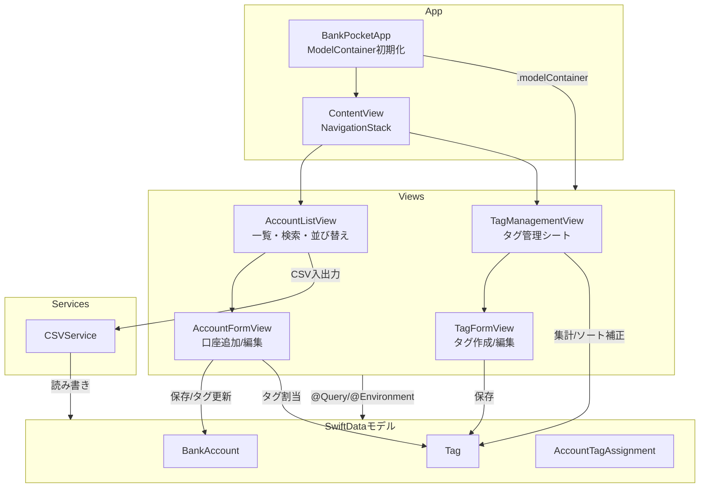
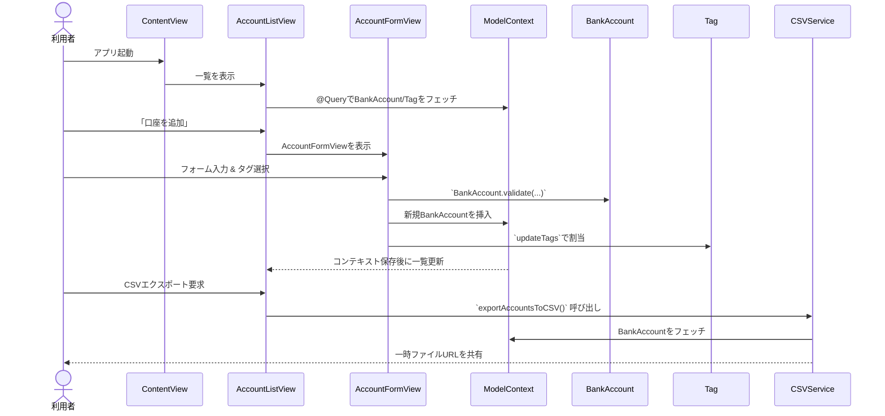

# bankpocket プロジェクト全体図

## コンポーネント概要

- `bankpocket/bankpocketApp.swift:10`  
  アプリのエントリーポイント。`ModelContainer`を構築し、初期タグやソート順の整備を行った上で`ContentView`へ渡します。
- `bankpocket/ContentView.swift:12`  
  ナビゲーションのルート。`AccountListView`を中心に、タグ管理やインポート/エクスポート画面をシートで表示します。
- `bankpocket/Views/AccountListView.swift:12`  
  口座一覧のプレゼンテーション層。`@Query`で SwiftData を監視し、`CSVService`による入出力や`AccountFormView`/`TagManagementView`への導線を担います。
- `bankpocket/Views/AccountFormView.swift:12`  
  口座の作成・編集フォーム。`BankAccount`のバリデーション及びタグ割り当て更新を担い、保存時に`ModelContext`へ書き込みます。
- `bankpocket/Views/TagManagementView.swift:12`  
  タグの一覧・整備画面。`TagFormView`と連携し、ソート順補正や未使用タグ削除などのメンテナンス操作を提供します。
- `bankpocket/Services/CSVService.swift:14`  
  SwiftData の `ModelContext` に依存するサービス層。CSV のインポート/エクスポートを通じてモデルを作成・更新します。
- `bankpocket/Models/*.swift`  
  SwiftData モデル群。`BankAccount`, `Tag`, `AccountTagAssignment` がリレーションを保持し、`ValidationError`が入力検証を共通化します。

## アーキテクチャマップ

## SwiftDataフロー（シーケンス図）

## 補足メモ

- `BankPocketApp.createDefaultTagsIfNeeded()`が起動時にタグ整備とソート順初期化を行い、ビュー層からは既存データが整った状態で利用できます。
- ビュー層は`@Query`/`@Environment(\.modelContext)`経由でSwiftDataにアクセスし、副作用のある操作（保存・削除・並び替え）は`ModelContext`に集約されています。
- CSV入出力は`CSVService`に閉じ込められているため、将来的な他フォーマット対応はサービス層の拡張で完結します。
